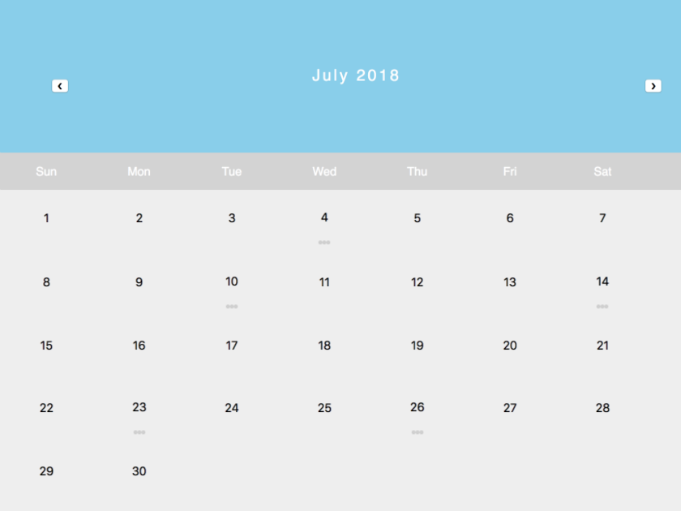

# Calendar App
You will be viewing the calendar for July 2018. To add an event to your calendar, simply select the desired day and input the information into the form and click submit. You should be able to see the event rendering underneath the day as three little dots. To view th events on a day, click the dots!
You'll be able to delete the event or update the information.

## Starting the Calendar
```
1. npm install
2. node script
3. npm run start-dev
```
Once you've finished these steps, your calendar should look like this:


## Running tests
```
1. npm run test
```